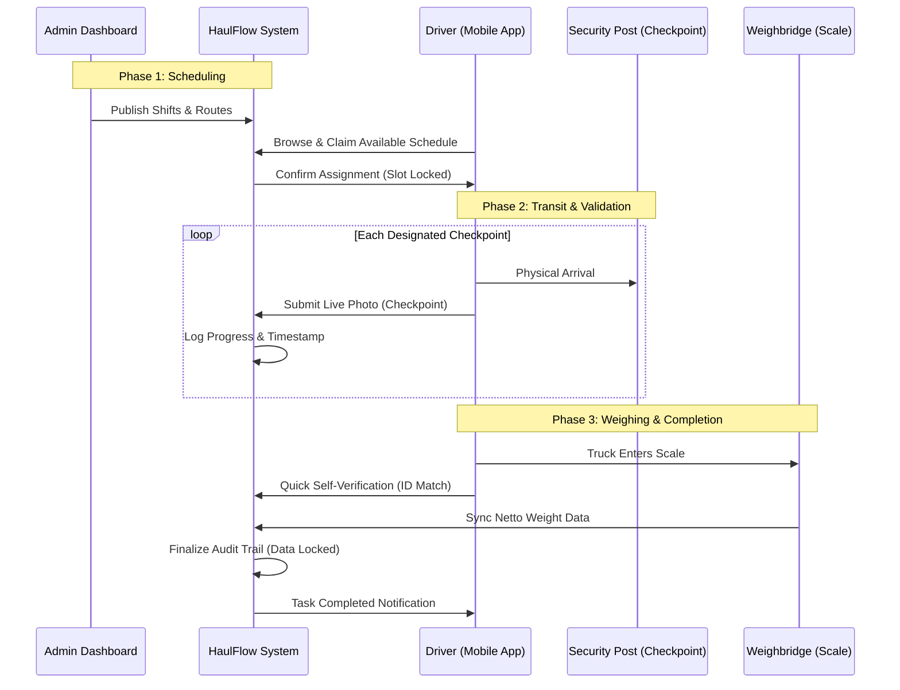
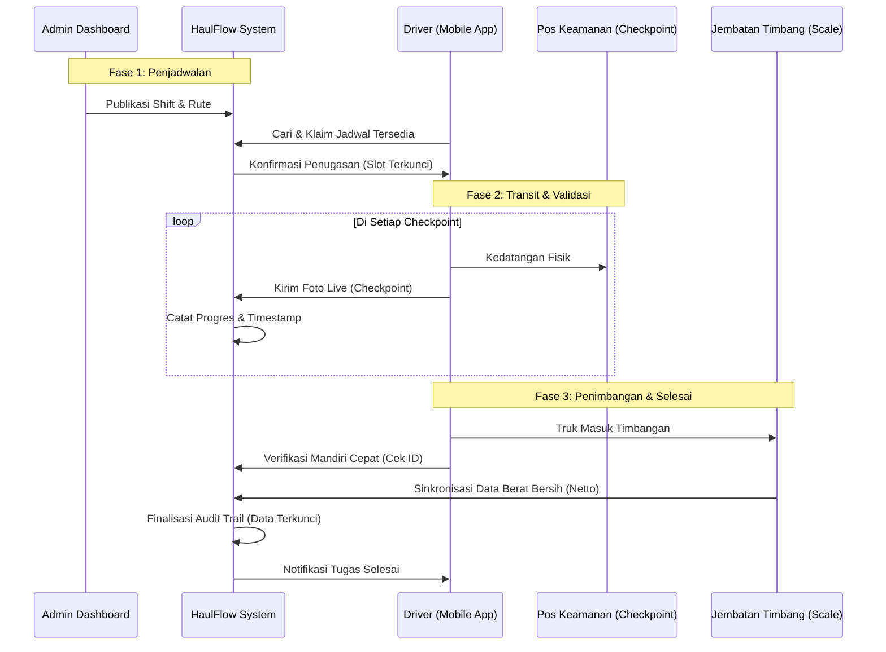

# 🔄 System Flow: Registration, Scheduling & Hauling Validation

[English Version](#english) | [Versi Bahasa Indonesia](#bahasa-indonesia)

---

## English Version

### 1. Pre-Operational Flow: Registration & Onboarding
Before the hauling process begins, the system establishes a secure foundation through entity registration to ensure every data point in the field is traceable.

*   **Driver & Vehicle Onboarding**: Drivers must register their legal identity (License/ID) and vehicle license plates. This database serves as the master reference for the "Self-Verification" process at the weighbridge.
*   **Role-Based Access Control (RBAC)**: Distinct permissions for Fleet Admins (schedule management) and Drivers (task execution).

### 2. Scheduling Mechanism: Open Assignment
HaulFlow utilizes a "Pull-System" for task distribution, allowing for better flexibility:
1.  **Schedule Publishing**: Admins upload shifts, routes, and quotas to the central dashboard.
2.  **Marketplace View**: Drivers browse a real-time list of available schedules on their mobile app.
3.  **Task Claiming**: Once a Driver selects a slot, the system triggers a **Concurrency Lock** to prevent double-booking.

### 3. End-to-End Operational Diagram

---

## Versi Bahasa Indonesia

### 1. Alur Pra-Operasional: Registrasi & Onboarding
Sebelum proses pengangkutan dimulai, sistem membangun landasan yang aman melalui registrasi entitas untuk memastikan setiap titik data di lapangan dapat dilacak secara akurat.

*   **Onboarding Driver & Kendaraan**: Driver wajib mendaftarkan identitas legal (SIM/KTP) dan nomor plat kendaraan. Database ini menjadi referensi utama untuk proses "Verifikasi Mandiri" di jembatan timbang.
*   **Role-Based Access Control (RBAC)**: Pembagian izin akses yang jelas antara Admin Armada (manajemen jadwal) dan Driver (pelaksanaan tugas).

### 2. Mekanisme Penjadwalan: Penugasan Terbuka (Open Assignment)
HaulFlow menggunakan "Pull-System" (Sistem Tarik) untuk distribusi jadwal hauling agar lebih fleksibel:
1.  **Publikasi Jadwal**: Admin membuat shift, rute, dan kuota ke dashboard pusat.
2.  **Tampilan Marketplace**: Driver menelusuri daftar jadwal yang tersedia secara real-time melalui aplikasi mobile.
3.  **Klaim Tugas**: Setelah Driver memilih slot, sistem mengaktifkan **Concurrency Lock** untuk mencegah pemesanan ganda.

### 3. Diagram Operasional End-to-End

